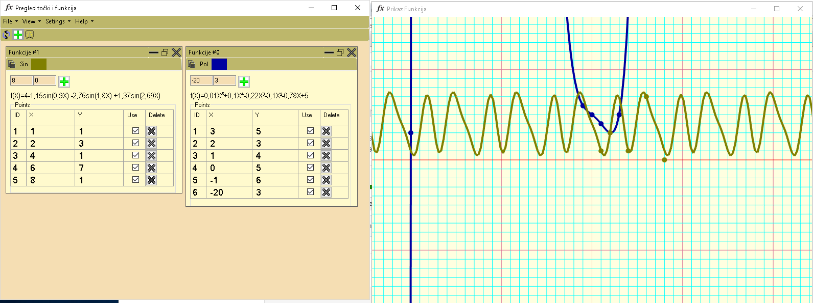

# Interpolator
Program witch can interpolate polinomal and sine functions with unlimitet number of points. Made in C# by me(Branimir Ričko). I'm sorry for the fact that some variable and methode names aren't in english, I'm from Croatia.
This is my first project and it was made for school project. I was learnig about databases, math, GUI, OOP, OpengGL. It was interesting.

